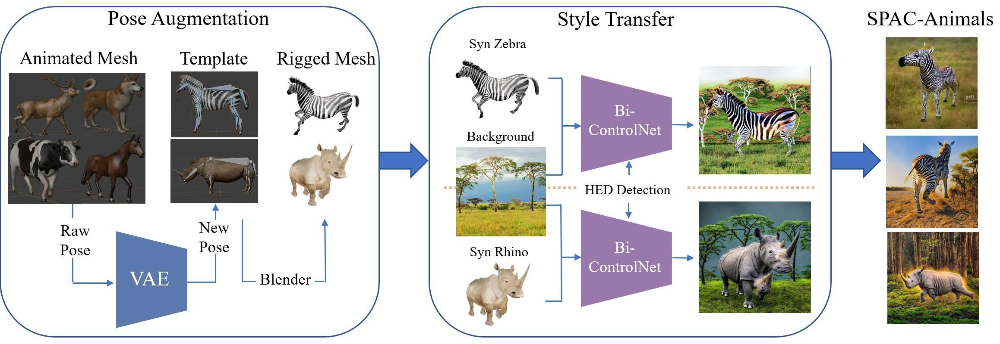

# SPAC-Net: Synthetic Pose-aware Animal ControlNet for Enhanced Pose Estimation
*Authors: Le Jiang, Sarah Ostadabbas*

<p align="center">
  <a href="#Introduction">Introduction</a> |
  <a href="#Framework">Framework</a> |
  <a href="#Main Results">Main Results</a> |
  <a href="#Experiment">Experiment</a> |
  <a href="#Acknowledgments">Acknowledgments</a> 
</p>

## Introduction
<p align="center">

</p>
This repository is the official repository of <a href='https://arxiv.org/abs/2305.17845'>SPAC-Net: Synthetic Pose-aware Animal ControlNet for Enhanced Pose Estimation</a>. 
In this work, we present a new approach called Synthetic Pose-aware Animal ControlNet (SPAC-Net), which incorporates 
ControlNet into the previously proposed Prior-Aware Synthetic animal data generation (PASyn) pipeline. We leverage the 
plausible pose data generated by the Variational Auto-Encoder (VAE)-based data generation pipeline as input for the 
ControlNet Holistically-nested Edge Detection (HED) boundary task model to generate synthetic data with pose labels that
are closer to real data, making it possible to train a high-precision pose estimation network without the need for real 
data. In addition, we propose the Bi-ControlNet structure to separately detect the HED boundary of animals and backgrounds, 
improving the precision and stability of the generated data.

## Framework


An overview architecture of our synthetic prior-aware animal ControlNet (SPAC-Net), composed of three parts: pose augmentation,
style transfer and dataset generation. The SPAC-Net pipeline leads to generation of our probabilistically-valid animal 
SPAC-Animals dataset.


The Bi-ControlNet architecture, which separates the detection of the HED boundary for the background and the subject.
## Main Results
### he effect of SPAC-Animals with limited real data of pose estimation results of the common backbones, HRNet-w32 tested on Zebra-300 and rhino-300  
| Method | Training Set | Test Animal | Average |Eye | Nose | Neck | Shoulders | Elbows | F-Paws | Hips | Kness | B-Paws | RoT | 
|--------|--------------|-------------|-----|------|------|-----------|--------|--------|------|-------|--------|-----|---------|
| MMPose | R(99)        | Zebra       | 78.7    |97.3| 95.8 | 83.2 | 78.8      | 77.1   | 62.6   | 86.0 | 74.9  | 59.8   | 82.4| 
| MMPose | R(99)+AP10K(8K)| Zebra      | 91.4    |97.5| 97.2 | 79.4 | 87.8      | 90.3   | 93.8   | **95.3** | 94.1  | 89.5   | 86.4| 
| MMPose | R(99)+SynAP(3K)| Zebra      | 92.4    |**97.8**| **98.3** | 81.1 | 94.0      | 93.5   | 92.0   | 93.7 | 93.5  | 89.0   | 87.6| 
| MMPose | R(99)+SPAC(3K)| Zebra       | **96.3**|**97.8**| 96.5 | **93.4** | **98.4** | **95.5** | 92.9   | **98.2** | **96.9**  | **95.7**   | **97.2**| 
| MMPose | R(99)        | Rhino       | 88.3    |93.1| 99.7 | 77.0 | 93.8      | 91.0   | 86.5   | 84.2 | 92.9  | 72.3   | 97.0| 
| MMPose | R(99)+AP10K(8K)| Rhino      | **96.7** |**98.1**| **98.6** | 82.4 | **98.6**      | **97.8**   | **97.9**   | 93.5 | **98.5**  | **98.6**   | **98.5**| 
| MMPose | R(99)+SynAP(3K)| Rhino      | 95.9    |99.6| 99.7 | **83.4** | 98.4      | 97.3   | 96.4   | 93.7 | 96.2  | 94.5   | 97.7| 
| MMPose | R(99)+SPAC(3K)| Rhino       | 95.9    |99.7| 98.0 | 81.8 | 97.5      | 96.4   | 97.1   | **94.2** | 96.5  | 96.2   | **98.5**| 

### A comparative analysis of different types of synthetic data.
| Method | Training Set | Test Animal |  Average |Eye  | Nose | Neck | Shoulders | Elbows | F-Paws | Hips | Kness | B-Paws | RoT  |
|--------|--------------|-------------|------|------|------|-----------|--------|--------|------|-------|--------|------|---------|
| MMPose | R(99)        | Zebra       |**97.3**|**95.8** | **83.2** | 78.8      | 77.1   |**62.6**  | 86.0 | 74.9  | 59.8 | 82.4| 78.7    |
| MMPose | Simple(3K)   | Zebra       | 30.7 | 19.9 | 31.1 | 48.0      | 34.1   | 36.4   | 41.9 | 38.3  | 34.0 | 45.6| 36.7    |
| MMPose | SynAP(3K)    | Zebra       | 47.1 | 39.9 | 36.0 | 64.7      | 38.9   | 27.9   | 55.4 | 52.9  | 38.0 | 61.6| 46.6    |
| MMPose | ControlNet(3K)| Zebra      | 88.8 | 81.8 | 53.1 | 78.2      | 62.8   | 58.1   | 67.6 | 76.6  |**73.0**| 66.4| 70.9    |
| MMPose | Bi-ControlNet(3K)| Zebra   | 84.7 | 73.4 | 78.3 |**89.4**   |**78.1**|**62.6**|**91.4**|**83.5** | 68.4 |**94.8**|**80.4**|
| MMPose | R(99)        | Rhino       | **93.1**|**99.7**|**77.0**|**93.8**|**91.0**|**86.5**| 84.2 |**92.9**|**72.3**|**97.0**|**88.3**    |
| MMPose | Simple(3K)   | Rhino       | 33.2 | 28.4 | 30.1 | 28.4      | 18.0   | 14.7   | 50.0 | 38.1  | 22.8 | 47.0| 29.9    |
| MMPose | SynAP(3K)    | Rhino       | 83.3 | 78.7 | 68.6 | 71.9      | 55.8   | 40.3   | 83.8 | 70.2  | 35.9 | 87.2| 64.9    |
|MMPose	|ControlNet(3K)|	Rhino	|68.3	|67.3	|66.6	|72.4	|59.4	|51.1	|81.2	|69.2	|51.7	|81.2	|65.8|
|MMPose	|Bi-ControlNet(3K)|	Rhino	|80.6	|77.3|	72.0|	85.0	|67.1	|46.0|	**91.1**	|77.3	|46.3	|86.8	|71.5|


## Experiment
To generate your own synthetic dataset, you need to first prepare some animal images as templates. In our work, we used 
Blender to rig the animal CAD models and rendered a large number of animal template images (3,000 for each species). We provide 
template images and annotations for two species, `zebra_template` and `rhino_template`. We also collected about 400 scenery images `background` from the internet to enrich the backgrounds of the synthetic 
data. You can download them from [here](https://coe.northeastern.edu/Research/AClab/SPAC-Animals).

When running the code, simply place the template image folder under the `test` folder and the background folder in 
the root folder. 
```
python SPAC_hed2image.py
```
### Installation
Please refer to <a href='https://github.com/lllyasviel/ControlNet/blob/main/README.md'>README.md</a> for Installation.
### SPAC-Animals Dataset
We provide synthetic images for two species, zebra and rhino, generated by SPAC-Net. You can download `SPAC-Zebras`
and `SPAC-Rhinos` from [here](https://coe.northeastern.edu/Research/AClab/SPAC-Animals).  
The `original 768x768` folder contains the generated original images, while the `train 300x300` folder contains 
the resized images used for training. Please note that the annotations correspond to the resized images. The format
of the data is as follows:
```
SPAC-Animals
├── annotations_99real
├── annotations_99real+3000syn
├── annotations_99real+3000syn
├── original 768x768
    │── 0000.jpg
    │── 0001.jpg
    │── ...
|── train 300x300
```
### SynAP Dataset
For SynAp data, please download `SynAP.zip` from [SynAP](https://coe.northeastern.edu/Research/AClab/SynAP/), which contains 3,000 synthetic zebra images and 3,600 synthetic images of 6 other animals, and 
different way to split the dataset. For more information, please refer to <a href='https://github.com/ostadabbas/Prior-aware-Synthetic-Data-Generation-PASyn-/blob/master/Readme.md'>README.md</a>
### Training on SynAP dataset
To train on Synthetic dataset, please replace the annotations file `ap10k-train-split1.json` and `ap10k-val-split1.json`  with the 
annotations we provided in SPAC-Animals or SynAP dataset before you start the training. In this work, we trained the pose estimation model provided by [AP10K](https://github.com/AlexTheBad/AP-10K)
```
bash tools/dist_train.sh configs/animal/2d_kpt_sview_rgb_img/topdown_heatmap/ap10k/hrnet_w32_ap10k_256x256.py 1
```

### Test set Zebra-300, Zebra-Zoo and Rhino-300 Dataset
1. For zebra, please download `zebra-300.zip` and `zebra-zoo.zip` from [SynAP](https://coe.northeastern.edu/Research/AClab/SynAP/).
2. For rhino, please download `rhino-300.zip` from
```
zebra-300/rhino-300
├── annotations
    │── annotations.json
    │── annotations.csv
├── crop
    │── 000000030372.jpg
    │── ...
├── raw
```
## Citation

If you use our code, datasets or models in your research, please cite with:

```
@misc{jiang2023spacnet,
      title={SPAC-Net: Synthetic Pose-aware Animal ControlNet for Enhanced Pose Estimation}, 
      author={Le Jiang and Sarah Ostadabbas},
      year={2023},
      eprint={2305.17845},
      archivePrefix={arXiv},
      primaryClass={cs.CV}
}
```
## Acknowledgement
Thanks for the open-source
* AP-10K: [A Benchmark for Animal Pose Estimation in the Wild, Hang Yu, Yufei Xu, Jing Zhang, Wei Zhao, Ziyu Guan, Dacheng Tao](https://github.com/AlexTheBad/AP-10K/)
* ControlNet: [Adding Conditional Control to Text-to-Image Diffusion Models,Lvmin Zhang and Maneesh Agrawala](https://github.com/lllyasviel/ControlNet)
* SmplifyX: [Expressive Body Capture: 3D Hands, Face, and Body from a Single Image, Pavlakos, Georgios and Choutas, Vasileios and Ghorbani, Nima and Bolkart, Timo and Osman, Ahmed A. A. and Tzionas, Dimitrios and Black, Michael J.](https://github.com/vchoutas/smplify-x).
## License 
* This code is for non-commertial purpose only. 
* For further inquiry please contact: Augmented Cognition Lab at Northeastern University: http://www.northeastern.edu/ostadabbas/ 
